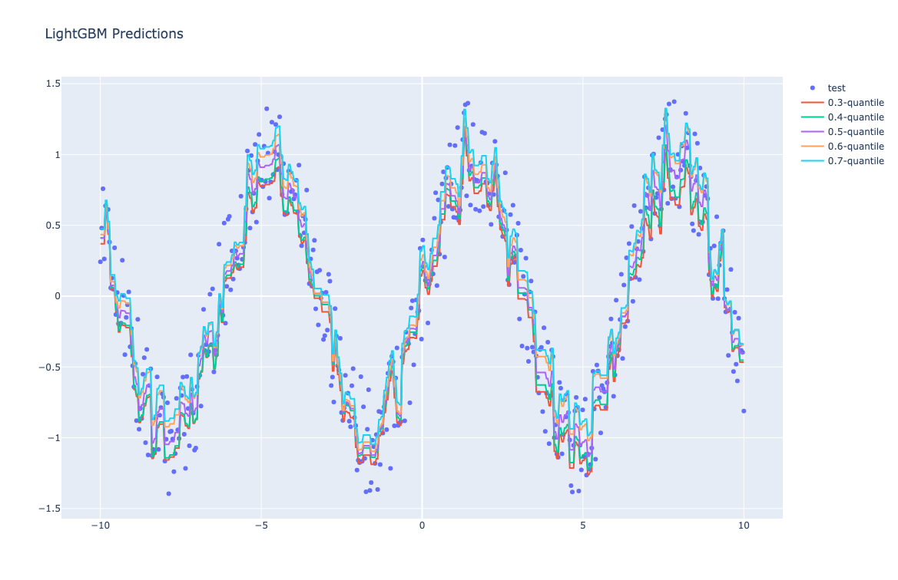
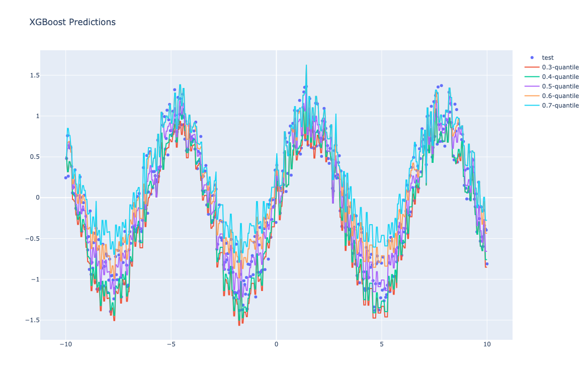

# About

Multiple quantiles estimation model maintaining non-crossing condition (or monotone quantile condition) using Lightgbm and XGBoost

# Getting Started
1. Clone the repo
2. Install requirements
```bash
pip install -r requirements.txt
```
3. Run example code
```python
pyhon run.py
```
4. Results




5. Structure
```
.
├── img              # sample image
├── module
│   ├── __init__.py
│   ├── abstract.py  # abstract quantile tree
│   ├── model.py     # seperate train logic
│   ├── objective.py # objective ftns
│   └── utils.py     # utils such as verify quantiles and preprocessing
├── README.md
├── requirements.txt
├── run.py           # example code
```
